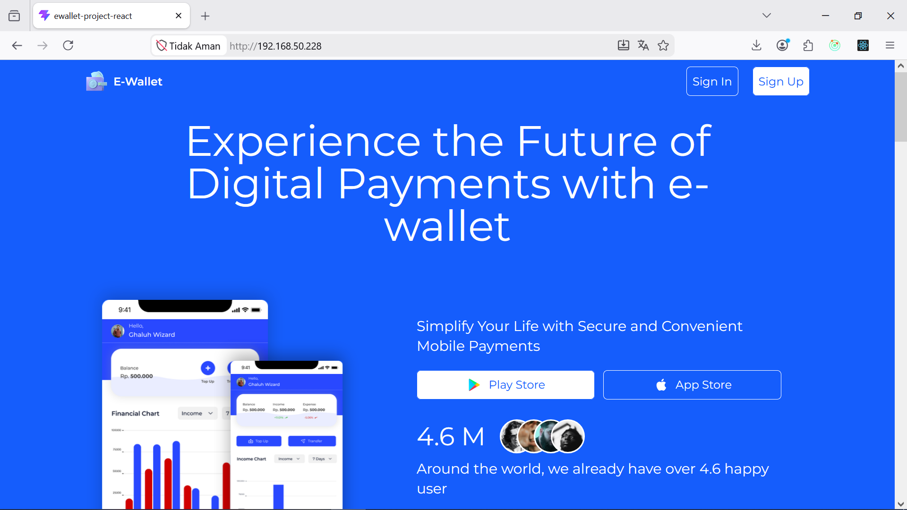
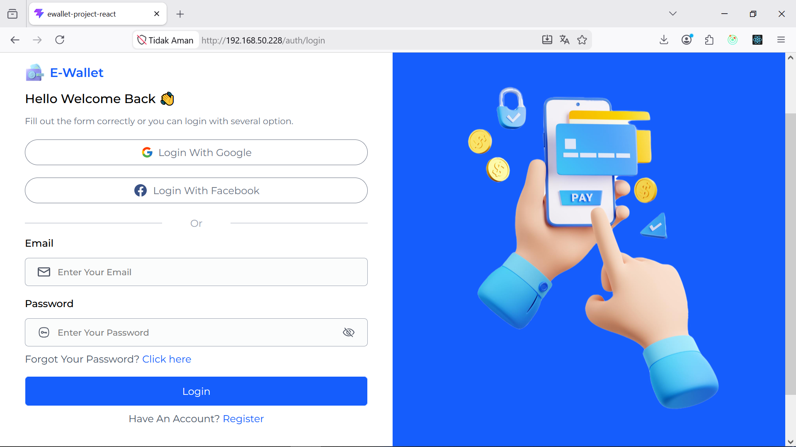
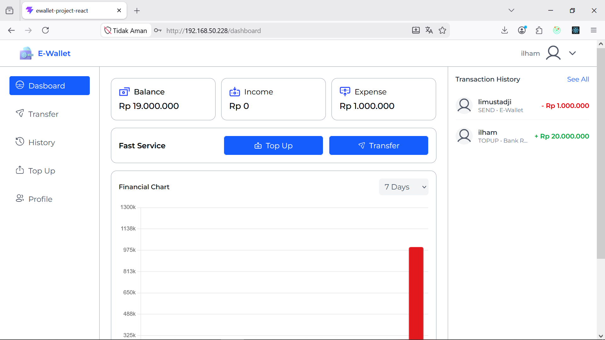

# E-Wallet App - Frontend

[](https://opensource.org/license/mit)
<br>
Frontend project for E-Wallet dashboard by Muh. Ilham Mursidi (Koda Batch 7 Fullstack Web Developer).

## Technologies Used

- [](https://react.dev/)
- [](https://vitejs.dev/)
- [](https://tailwindcss.com/)
- [](https://redux-toolkit.js.org/)
- [](https://nginx.org/)
- [](https://www.docker.com/)

## Features

- Mobile-First Responsive UI
- User Authentication (Login, Logout, Create PIN)
- Interactive Dashboard (Balance, Transaction History)
- Fund Transfer & Top Up Interfaces
- Profile Management


## Usage Instruction

### Environment Setup

1. Create your environment file on the root directory named `.env`

```env
# Use relative path if using nginx reverse proxy
VITE_API_URL=/ewallet
```

### Running the Application (Local Development)

1. Clone this repository

```bash
$ git clone https://github.com/Ilhammursidi/React-Ewallet-Project.git
```

2. Install dependency

```bash
$ npm install
```

3. Run the development server

```bash
$ npm run dev
```


## Changelog

| Version | Description                                                                                                                        |
| ------- | ---------------------------------------------------------------------------------------------------------------------------------- |
| 1.0  | Setup Docker multi-stage build, Nginx and setup GitHub Actions for GHCR deployment config by [ilhammursidi](https://github.com/ilhammursidi) |

## How to Contribute

- Fork this repository
- Create your changes
- Commit your changes (Please strictly follow the [Conventional Commits](https://www.conventionalcommits.org/en/v1.0.0/) standard: `feat:`, `fix:`, `chore:`, `docs:`)
- Push to the branch
- Open a Pull Request

### Screenshot







[Preview](https://react-ewallet-project.vercel.app/)

## License

This project is licensed under the MIT License

## Related Project

[Backend E-Wallet Repository](https://github.com/Ilhammursidi/Ewallet-Backend.git)